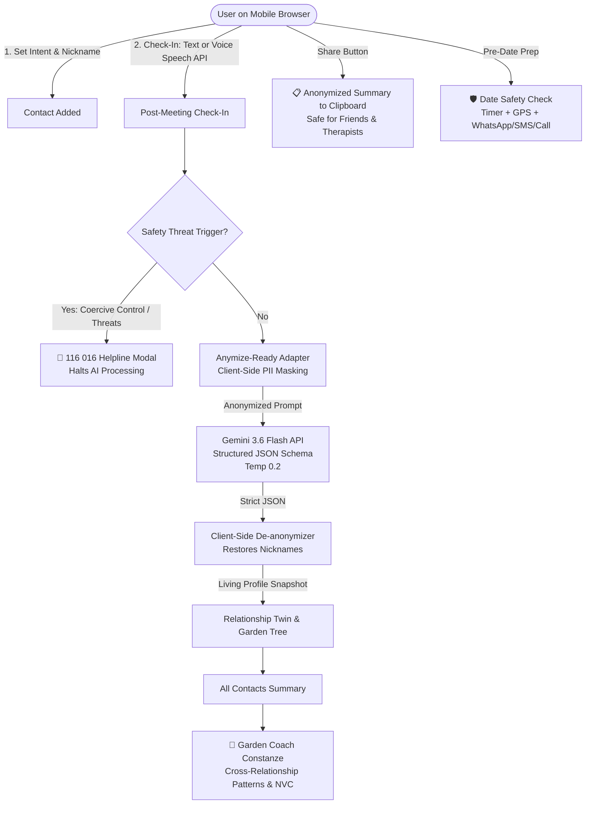

# WiseHer 🌿
> *"Know your patterns, trust your perception."*

**WiseHer** is a single-page, privacy-first web application designed as an empowering relationship reflection coach for women. Built mobile-first for phone browsers, WiseHer helps women record grounded post-meeting check-ins, observe behavioral patterns over time without self-gaslighting, and cultivate confidence in their intuition through an organic "living garden" model.

---

## 🌐 Live Demo & Repository
- **Live Application (GitHub Pages)**: [https://luli-test.github.io/wiseher/](https://luli-test.github.io/wiseher/)
- **GitHub Repository**: [https://github.com/luli-test/wiseher](https://github.com/luli-test/wiseher)
- **Hosting Architecture**:
  - **Live Production URL**: Hosted on GitHub Pages via automated, decoupled secret deployment (`scripts/deploy-gh-pages.cjs`). The built production bundle does **not** contain any API keys.
  - **Firebase Hosting**: Fully configured for Google Cloud project `aiwomen26ham-4435` (`https://aiwomen26ham-4435.web.app`). Deployment attempt was executed via `npx firebase deploy --only hosting --project aiwomen26ham-4435` (GCP API status: `HTTP Error: 403, The caller does not have permission`). GitHub Pages is the live, active production URL.

---

## ⏱️ 2-Minute Demo Script

Follow this step-by-step walkthrough to experience WiseHer during a presentation or review:

1. **Step 1: The Relationship Garden (0:00 - 0:30)**
   - Open [WiseHer](https://luli-test.github.io/wiseher/) on a phone or click **Phone View** on desktop.
   - Observe the pre-loaded 8-week demo baseline contact **"Alex" (Dating)**, currently at the *Bare Branches* stage after 6 check-ins.
   - Note the interaction frequency streak badge (`☕ Steady Cadence`), which remains distinct from the plant's health.

2. **Step 2: Inspecting the Relationship Twin (0:30 - 1:00)**
   - Tap on Alex's card to open the **Relationship Twin**.
   - Notice the **Honesty Badge** indicating generation origin (`Generated by Gemini (gemini-3.6-flash)` or `Offline fallback (rule-based)`).
   - Review the AI-synthesized timeline observations, "What changed" shift, and Green/Yellow/Red patterns phrased constructively as *"can be a sign of"*.
   - Tap the **Share Anonymized** button to copy a masked report safe for a friend or therapist.
   - Click the pencil or trash icon on a check-in card to observe how entries can be edited or deleted with automatic twin re-synthesis.

3. **Step 3: Coach Constanze Synthesis (1:00 - 1:30)**
   - Switch to the **Coach Constanze** tab in the bottom dock.
   - Review the holistic cross-relationship synthesis, reflecting your habits and needs without clinical diagnostics.
   - Tap **Copy NVC Template** for a pre-structured Nonviolent Communication boundary script ready to send or practice.

4. **Step 4: Live Check-In & Date Safety (1:30 - 2:00)**
   - Click **Settings** (gear icon) in the header to view client-side API key management (keys stay in `localStorage`).
   - Tap **Guided Check-In** to test live voice-to-text or manual input.
   - Switch to **Date Safety** tab, trigger a 1-minute safety timer, view automatic GPS coordinate resolution, and observe one-tap WhatsApp / SMS / Call dispatch.

---

## 🛠️ How We Built It

- **Google Antigravity Agent**: We utilized Google Antigravity to pair-program the application iteratively across the 48-hour hackathon, executing local builds, environment configurations, and deployment pipelines.
- **Prompts Written by the Team**: All coaching prompts—including the grounded Relationship Twin system prompt, Nonviolent Communication (NVC) structures, and the "can be a sign of" psychological framing—were carefully crafted by the team to prevent clinical labeling or self-gaslighting.
- **Iterations Over Two Days**: We refined the core user loop across multiple development cycles: starting from local mockups, moving to real structured Gemini Flash inference with JSON schemas, adding client-side anonymization, integrating Web Speech voice transcription, and implementing the Date Safety companion.

---

## 1. What WiseHer Does & Who It Is For

Early in dating or friendships, women frequently experience self-doubt and second-guessing ("Am I overreacting?", "Did they really mean it like that?", "Maybe they're just busy"). Subtle red flags and communication cycles often get lost in emotional fog.

**WiseHer provides a calm, safe sanctuary to:**
1. **Anchor the Facts**: Capture what actually happened right after a date or conversation (via text or voice-to-text) while memories and bodily sensations are fresh.
2. **Clarify Intent**: Set explicit relational intentions upfront (`dating`, `friendship`, `unsure`, or `distance`) to evaluate whether the interaction aligns with personal boundaries.
3. **Visualize Relationship Health**: Track each person as a living tree in your personal garden—evolving organically across 5 stages (`bare`, `budding`, `leafy`, `blooming`, `flourishing`) based on consistency, reciprocity, and respect.
4. **Learn Cross-Relationship Habits**: Receive holistic synthesis from **Coach Constanze** to identify personal habits and needs across all connections.
5. **Stay Physically Safe**: Launch a **Date Safety Check** with an automated countdown, GPS coordinate generation, and one-tap WhatsApp / SMS / Call dispatch.

---

## 2. Architecture & Flow



---

## 3. Honest System Disclosure: What is AI, Rule-Based, and Pre-computed Demo Data

We believe in complete transparency about how intelligence is generated in WiseHer:

| Feature Component | Implementation Type | Description |
| :--- | :--- | :--- |
| **Relationship Twin Analysis** | **Real AI (`gemini-3.6-flash`)** | LLM inference (text only) with strict JSON schema enforcing: tree stage (`bare` to `flourishing`), date-linked observations, "what changed", green/yellow/red patterns phrased strictly as *"can be a sign of"*, reflection questions, and intent-aligned next steps. |
| **Garden Coach (Constanze)** | **Real AI (`gemini-3.6-flash`)** | One holistic LLM call synthesizing anonymized twins across all contacts: reveals cross-relationship habits and needs, highlights 3 strengths, 1 practice area, and generates an actionable Nonviolent Communication (NVC) template. |
| **Data Anonymization Engine** | **Anymize-Ready Adapter & Rule-based Regex** | Client-side adapter designed for the Anymize API (API key pending; local rule-based anonymizer currently active). Pre-flight masking strips personal names, nicknames, email addresses, phone numbers, and dates into tokens (`[PERSON_1]`, etc.) before any payload leaves the device. |
| **Emergency Safety Trigger** | **Rule-based** | High-urgency heuristic regex scanning for domestic violence, physical intimidation, or threats. Bypasses LLM analysis immediately to display the German Helpline `116 016` banner. |
| **Streak & Frequency Badges** | **Rule-based** | Interaction frequency calculations displaying distinct non-plant badges (`☕`, `💬`, `🔥`, `⚡`, `💎`) to clearly separate cadence from relationship health. |
| **Date Safety Check** | **Client-side Browser APIs** | Real-time `setInterval` countdown clock, HTML5 Geolocation API (`navigator.geolocation`) coordinate lookup, and OS scheme launchers (`wa.me:`, `sms:`, `tel:`). |
| **Local Offline Fallback** | **Rule-based Deterministic** | Fallback reflection generator ensuring the app functions smoothly even without internet connectivity or an API key. Only activated upon explicit user confirmation, displaying a prominent honesty badge. |
| **8-Week Baseline Trajectory** | **Pre-computed Demo Data** | Curated 6-entry timeline ending on 2026-09-12 with contact "Alex", showcasing a realistic trajectory from charming consistency to subtle withdrawal and eventual gaslighting. |

---

## 4. Privacy & Safety Design

WiseHer was built with a strict **Local-First, Privacy-by-Design** philosophy:
- **Zero Cloud Storage**: All contacts, check-ins, reflections, and safety settings live solely in browser `localStorage`. No user accounts, cookies, or remote databases.
- **Nicknames Only**: Contact entries encourage single nicknames or initials rather than full legal names.
- **Client-Side Voice Processing**: Voice check-ins use the browser's native Web Speech API (`webkitSpeechRecognition`). Speech is converted to text locally; audio files are **never recorded or uploaded**.
- **Double-Layer Anonymization**: All prompts sent to Gemini are anonymized client-side. Returned JSON is de-anonymized in memory immediately before UI rendering.
- **Share Anonymized Summary**: Tapping "Share Anonymized" on any twin snapshot copies a strictly masked report (`[PERSON_1]`) to the clipboard, empowering users to consult a friend or therapist without leaking identities.
- **German Violence Against Women Helpline (116 016)**: Direct, confidential support integration with one-tap dialing and multi-language support.
- **Clear Limitations**: The UI explicitly informs users that the Date Safety Check operates client-side and requires a device tap to trigger messages (with automated server-side SMS planned for future iterations).

---

## 5. Tools & Technologies Used

- **Google Antigravity**: Agentic workflow automation, task execution, testing, and Git operations.
- **Gemini API (`gemini-3.6-flash`)**: High-speed, structured JSON schema outputs (`responseSchema`) with low temperature (`0.2`) for reproducible, grounded coaching insights.
- **Anymize-ready Anonymization Adapter**: Modular privacy adapter (`src/services/anonymizer.js`) prepared for the Anymize API (API key pending; local rule-based anonymizer active).
- **React 18 & Vite**: Lightning-fast, mobile-first responsive single-page web architecture.
- **Tailwind CSS**: Custom, soothing earthy color palette (`sand`, `sage`, `terracotta`, `warmamber`) curated to reduce anxiety and create an inviting reflection space.
- **Web Speech API**: In-browser speech-to-text transcription for effortless verbal debriefs.
- **HTML5 Geolocation API**: Browser GPS retrieval for one-tap emergency location sharing.
- **Lucide Icons**: Clean, accessible iconography.
- **GitHub Pages**: Automated decoupled CI/CD production hosting.

---

## 6. How to Run Locally

### Prerequisites
- Node.js LTS (v18+ or v20+)
- Git

### Installation Steps
```bash
# 1. Clone the repository
git clone https://github.com/luli-test/wiseher.git
cd wiseher

# 2. Install dependencies
npm install

# 3. Configure environment
cp .env.example .env
# Open .env and insert your Gemini API Key:
# VITE_GEMINI_API_KEY=your_actual_gemini_api_key_here
# Optional coach video demo:
# VITE_COACH_VIDEO_URL=https://example.com/coach-video.mp4

# 4. Start local development server
npm run dev
```

Visit `http://localhost:5173` in your browser. (Click the "Phone View" toggle in the header for a mobile frame simulation).

---

## 7. Future Horizons

1. **Dating App Integrations**: Direct partnerships with platforms like Bumble, Hinge, or Tinder to import verified match timestamps and prompt timely check-ins after dates.
2. **Interactive NVC Roleplay**: Voice-driven conversational practice using Gemini Multimodal Live API to rehearse difficult boundary conversations before having them in real life.
3. **Cloud Emergency Guardian**: An optional opt-in background service that monitors the safety timer server-side and automatically dispatches SMS/webhook notifications if the user's phone runs out of battery or goes offline.
4. **Multi-Language Support**: Expanding beyond English and German to include Spanish, French, Arabic, and Turkish.

---

## 8. Team & Hackathon Submission

Built at the AI.WOMEN Hackathon 2026 by AI.GROUP, Hamburg, 12-13 September 2026. Team WiseHer:
- Lisa-Maria Ubbenjans - Build & AI: app development with Google Antigravity, Gemini integration, local testing, deployment.
- Antje Oelgeschlaeger - Team lead & product: submission process, organisation, project and team logos, pitch and documentation.
Idea, concept and demo design: both.

